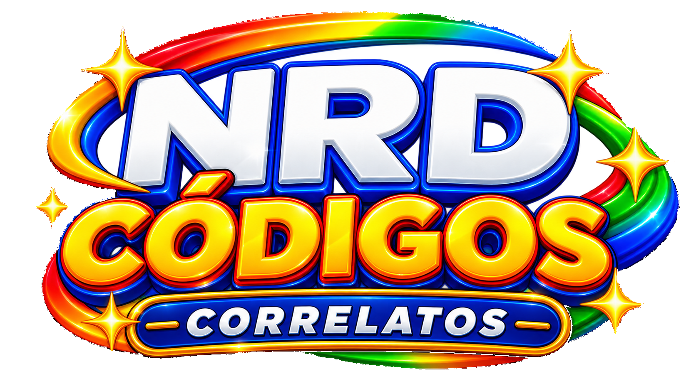
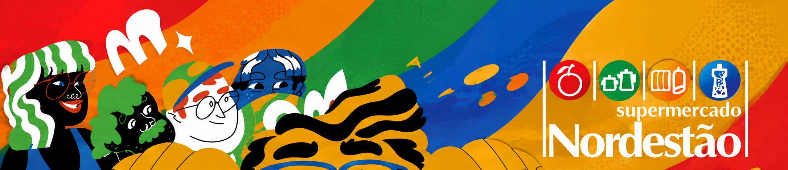
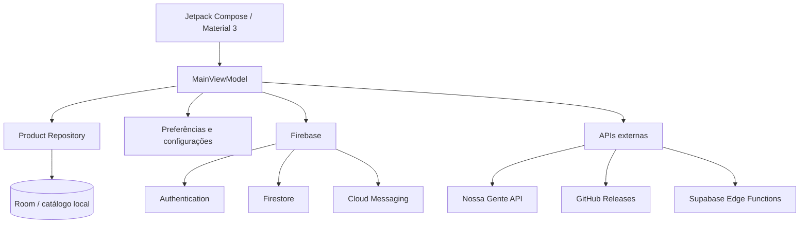

<p align="center">
  
</p>

<h1 align="center">NRD Códigos · NRDLOJAS v2</h1>

<p align="center">
  Aplicativo Android para consulta e gerenciamento de códigos de produtos, organização de catálogo, promoções, temas visuais e operações administrativas do ecossistema NRD.
</p>

<p align="center">
  <a href="https://github.com/bichocutela/NRDLOJAS-v2/releases/latest"></a>
  
  
  
  
  
  <a href="https://github.com/bichocutela/NRDLOJAS-v2/actions/workflows/main.yml"></a>
  
</p>

<p align="center">
  <a href="#download">Download</a> |
  <a href="#visão-geral">Visão geral</a> |
  <a href="#recursos">Recursos</a> |
  <a href="#visual-e-temas">Visual e temas</a> |
  <a href="#arquitetura">Arquitetura</a> |
  <a href="#tecnologias">Tecnologias</a> |
  <a href="#compilação">Compilação</a> |
  <a href="#documentação">Documentação</a>
</p>

---

## Visão geral

O **NRD Códigos / NRDLOJAS v2** centraliza a consulta de produtos e códigos em uma experiência Android moderna, construída em Jetpack Compose. O projeto combina catálogo local, recursos conectados, leitura de código de barras, promoções, notificações, personalização visual e áreas administrativas em uma única aplicação.

A arquitetura mantém a interface separada das camadas de dados e integra recursos locais e remotos por meio de Room, DataStore, Firebase, Supabase e APIs externas.

---

## Download

- **APK mais recente:** [GitHub Releases](https://github.com/bichocutela/NRDLOJAS-v2/releases/latest)
- **Histórico de versões:** [Todas as releases](https://github.com/bichocutela/NRDLOJAS-v2/releases)
- **Compilações e validações:** [GitHub Actions](https://github.com/bichocutela/NRDLOJAS-v2/actions)

> Para uso normal, prefira sempre o APK publicado na release mais recente.

---

## Visual e temas

<p align="center">
  
</p>

<p align="center">
  
  
  
</p>

<p align="center">
  
  
  
</p>

A aplicação possui identidade visual dinâmica, variantes de cores, fundos temáticos e suporte ao estilo **Glass Soft**, mantendo a apresentação adaptável às diferentes áreas do app.

---

## Recursos

| Área | Recursos principais |
| --- | --- |
| **Pesquisa e catálogo** | Busca de produtos e códigos, catálogo local e organização dos dados para consulta rápida. |
| **Código de barras** | Leitura por câmera com ML Kit e ZXing, além de exibição de códigos no próprio aplicativo. |
| **Uso e histórico** | Estruturas para histórico do catálogo, acompanhamento de uso global e dados recentes. |
| **Promoções** | Área de promoções integrada aos serviços do Nossa Gente, com fluxo próprio de autenticação e sincronização. |
| **Abas e categorias** | Abas dinâmicas e categorias gerenciáveis dentro do aplicativo. |
| **Notificações** | Firebase Cloud Messaging, notificações de produtos, alterações e atualizações do aplicativo. |
| **Atualizações** | Verificação de novas versões e distribuição de APKs por GitHub Releases. |
| **Aparência** | Temas por cor, fundos personalizados, modo escuro e estilo Glass Soft. |
| **Painel administrativo** | Áreas protegidas para administração, gerenciamento de produtos e configurações operacionais. |
| **Painel Mestre** | Gestão avançada de catálogo, abas, aparência global, sugestões e recursos administrativos. |
| **Banners** | Recursos para envio, validação, pré-visualização e aplicação de banners temáticos. |
| **Exportação** | Utilitários de exportação em PDF para informações compatíveis dentro do app. |

---

## Fluxo principal

O aplicativo parte da tela de **pesquisa**, com navegação para recursos complementares por meio do menu lateral e rotas dedicadas.

```text
Pesquisa
├── Abas dinâmicas / categorias
├── Promoções
├── Configurações
├── Sobre
└── Área de gestão
    ├── Administrador
    └── Mestre
        ├── Gerenciar produtos
        └── Gerenciar abas
```

---

## Arquitetura



---

## Tecnologias

| Camada | Tecnologia |
| --- | --- |
| **Linguagem** | Kotlin |
| **Interface** | Jetpack Compose + Material 3 |
| **Android** | minSdk 24 · targetSdk 36 |
| **Navegação** | Navigation Compose |
| **Estado** | ViewModel + Kotlin Coroutines |
| **Banco local** | Room |
| **Preferências** | AndroidX DataStore |
| **Autenticação e nuvem** | Firebase Auth + Firestore |
| **Push** | Firebase Cloud Messaging |
| **Backend auxiliar** | Supabase Edge Functions |
| **Rede** | Retrofit + OkHttp + Moshi + Kotlin Serialization |
| **Imagens** | Coil |
| **Código de barras** | Google ML Kit + ZXing |
| **Tarefas em segundo plano** | WorkManager |
| **Gráficos** | Vico |
| **CI/CD** | GitHub Actions |

---

## Requisitos

- Android **7.0 ou superior** (API 24+).
- Acesso à internet para sincronizações, promoções, notificações e verificação de atualizações.
- Câmera quando o usuário utilizar leitura de código de barras.
- O catálogo local permite que partes da consulta continuem disponíveis conforme os dados armazenados no aparelho.

---

## Compilação

### Debug

```bash
./gradlew assembleDebug
```

No Windows:

```bat
gradlew.bat assembleDebug
```

### Release

A versão de produção utiliza configuração de assinatura e variáveis de ambiente. O fluxo automatizado do repositório gera as versões publicadas por meio do **GitHub Actions**.

Para acompanhar o processo, consulte a aba [Actions](https://github.com/bichocutela/NRDLOJAS-v2/actions).

---

## Estrutura resumida

```text
NRDLOJAS-v2/
├── app/
│   └── src/main/
│       ├── java/com/example/
│       │   ├── data/
│       │   ├── ui/
│       │   └── util/
│       ├── assets/themes/
│       └── res/
├── assets/themes/
├── supabase/functions/
├── .github/workflows/
├── firestore.rules
└── README.md
```

---

## Documentação

Documentos técnicos disponíveis no repositório:

- [Sincronização de Promoções](PROMOTIONS_SYNC.md)
- [Revisão do contrato de autenticação](AUTH_CONTRACT_REVIEW.md)
- [Supabase Functions](supabase/functions/README.md)

---

## Status do projeto

O NRDLOJAS-v2 está em desenvolvimento ativo. Novas versões são distribuídas pelo pipeline de GitHub Actions e publicadas em **Releases**, mantendo o APK centralizado no próprio repositório.

<p align="center">
  <strong>NRD Códigos · NRDLOJAS v2</strong><br/>
  Consulta, organização e gestão em uma experiência Android integrada.
</p>
