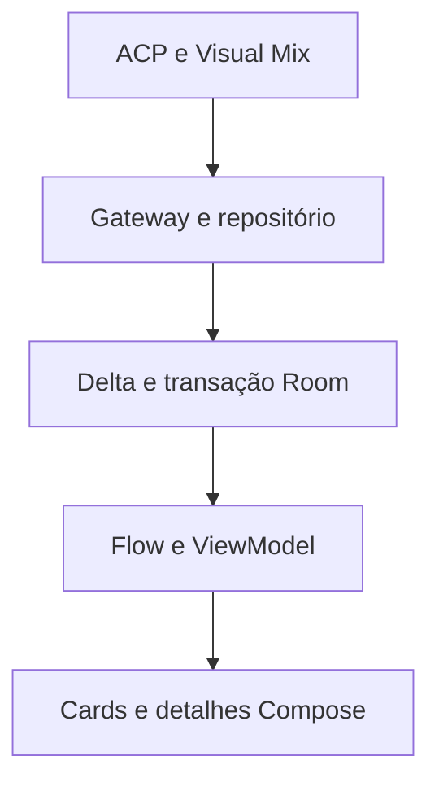

# Promoções ACP: arquitetura e operação

## Fluxo de dados

O gateway autentica identidade Firebase ou capacidade de sessão do NRD, verifica o acesso atual e restringe o escopo Promoções à fonte De/Por da Cidade Jardim. Credenciais ACP, cookies e chaves Gemini permanecem no servidor. Não há retorno ao login Nossa Gente.

## Componentes e blocos

| Bloco | Arquivos principais | Responsabilidade |
| --- | --- | --- |
| Detalhes | `ui/PromotionProductDetailsContent.kt`, `ui/AcpProductsPanel.kt`, `ui/PromotionsScreen.kt` | Cards clicáveis, EAN e mesmo componente comercial/barcode de Consultar Preços. Os detalhes usam o snapshot ACP local; nenhum GET adicional ao tocar. Campanhas e banners da consulta de preços permanecem disponíveis. |
| Imagens | `data/promotions/ProductImageRepository.kt` | Consulta desacoplada por GTIN válido, família Open Facts, cache persistente de URLs/ausência e limitação global de requisições. Apenas cards visíveis consultam imagens. ACP tem prioridade e há placeholder em erros. Metadados de origem permanecem no cache técnico, sem poluir a interface dos cards e detalhes. |
| Categorias | `categories.mjs`, `server-cache.mjs`, `PromotionCategory.kt` | Os 16 departamentos oficiais Nordestão são compartilhados entre catálogo, classificador e Android. O catálogo oficial tem prioridade; Gemini e regras de reserva são identificados como inferidos e nunca sobrescrevem uma classificação oficial. Descrições completas são tratadas como dados, enum fechado e JSON validado. Cache por EAN/código/descrição/taxonomia com lease e precondições; sucesso nunca é reenviado. Regras locais corrigem termos ambíguos e permitem operação sem IA. |
| Persistência/sync | `promotion-sync.mjs`, `PromotionDelta.kt`, `PromotionDatabase.kt`, `AcpPromotionsRepository.kt` | Snapshot ACP compartilhado, páginas imutáveis e ponteiro atômico. Room guarda fonte bruta sanitizada, ofertas e metadados; delta, remoções e revisão são publicados numa transação. Documentos Visual Mix são reutilizados por revisão. |
| Estado/background | `PromotionSyncCoordinator.kt`, `PromotionsViewModel.kt`, `PromotionNotificationWorker.kt` | Um coordenador serializa tela, monitor e worker. `PromotionSyncRequests.kt` agrupa solicitações repetidas e preserva uma varredura manual após uma checagem silenciosa em andamento. StateFlow distingue requisição de dados/refresh explícito de checagem silenciosa. Room alimenta a UI independente da tela estar aberta. Outbox persistente limitada a 100 ciclos pendentes e tags estáveis evitam duplicar notificações. |

## Sincronização incremental

O ACP não tem um `updated_at` comprovado para esta rota. Por isso, a comparação acontece no gateway: ele consulta a fonte completa **uma vez por versão de snapshot**, compartilhada entre aparelhos, com intervalo mínimo de 60 segundos e lease entre instâncias. Os aparelhos consultam `promotion_status`; quando a revisão difere, enviam IDs/hashes a `promotion_sync` e recebem apenas itens alterados e IDs removidos. Uma resposta incompleta não substitui o cache.

Quando o snapshot de um check silencioso vence, o gateway aguarda a atualização compartilhada naquele mesmo ciclo. Assim a checagem de 60 segundos já pode enxergar produtos recém-inseridos, sem dobrar a quantidade de varreduras. Em atualização explícita, o app usa `promotion_refresh`: arrastar para baixo, tocar no botão Atualizar ou tentar novamente força uma leitura ACP naquele momento e recebe o delta imediatamente. O cache anterior segue visível durante rede lenta, falha ACP ou processamento. Páginas antigas têm retenção de 30 minutos antes da limpeza, permitindo leituras já em andamento.

O primeiro download é uma baseline, inclusive se tiver zero produtos; não gera centenas de notificações de produtos já existentes. A identidade da oferta é loja/código interno, então mudar preço, descrição, categoria, estoque ou validade não transforma o produto em novo. Produtos removidos e posteriormente recolocados são novos na reinserção.

## Monitor, novas ofertas e notificações

`ProcessLifecycleOwner` inicia um monitor de 60 segundos enquanto o aplicativo está em primeiro plano, inclusive em outras abas. Ele começa a consultar após o primeiro uso das ofertas. O monitor continua leve: normalmente consulta apenas o estado/revisão compartilhada. Arrastar para baixo e o botão Atualizar são caminhos explícitos e forçam a varredura ACP para trazer novas ofertas naquele momento. WorkManager executa o mesmo coordenador a cada 15 minutos, com conectividade e backoff, quando permitido pelo Android. Doze, economia de bateria e “Forçar parada” podem adiar ou impedir tarefas; isto não é push instantâneo.

O botão Ofertas novas mostra um badge e filtra os produtos adicionados no último ciclo que trouxe adições, por loja selecionada. Checagens sem adições, inclusive alterações de preço, estoque e categoria, mantêm esse lote; remoções retiram os itens que já não estão em oferta. Toque novamente em Todas as ofertas para remover o filtro. Preço/categoria/estoque alterados não contam como adição.

A transação de sincronização grava eventos numa outbox antes da entrega. Em primeiro plano, a novidade aparece na UI. Fora dele, a entrega respeita preferências locais, configuração remota e permissão de notificações Android. Se houver loja favorita, restringe a ela; sem favorita, abrange as lojas habilitadas. O clique abre Promoções. Tags Android e IDs de histórico estáveis tornam uma tentativa repetida idempotente.

## Configuração e limites reais

- `GEMINI_API_KEY` no ambiente da Edge Function; modelo opcional `PROMOTION_GEMINI_MODEL`, padrão `gemini-3.5-flash-lite`. Nenhuma chave privada entra no APK.
- `server_promotion_cache` é coleção exclusiva do servidor, bloqueada pelas regras Firestore para clientes. Leases são cercados por `updateTime`, evitando sobrescrita por instâncias antigas.
- Classificação acontece em lotes limitados, com cooldown, cache permanente de sucesso e retry de falhas. Descrição alterada é um novo conteúdo a classificar. Categorias são sugestões validadas, não promessa de precisão absoluta.
- O Room também persiste a categoria no snapshot comercial; abertura offline não chama Gemini.
- Open Facts não cobre todos os produtos. EAN ausente/inválido, produto não encontrado e imagem indisponível mantêm placeholder. Ausência é guardada sete dias; erro temporário, cinco minutos; URL encontrada, um ano. Coil guarda os bytes das imagens.
- Cidade Jardim usa ACP. Outras lojas só ficam disponíveis após habilitação/publicação pelo Mestre; os dados de arquivo não inventam estoque ou campos que o documento não informa.
- Indicador visual gira na primeira carga, no refresh explícito ou no download de alterações. `finally` restaura o estado em sucesso, exceção e cancelamento; checagens silenciosas não giram continuamente.

## Verificação

Testes Node cobrem autorização, contratos ACP, sanitização, JSON/categorias controladas, lease com um vencedor, hashes estáveis, troca com contagem igual, deltas e preservação de snapshot em falhas. Testes Android cobrem GTIN/categoria, baseline, deltas, rollback da transação, reabertura do banco com EAN/estoque/validade e estado offline. O CI reserva uma tag única de forma atômica e a vincula ao SHA compilado, evitando que builds paralelas sobrescrevam o APK da mesma versão. Compila/testa Android e gera APK assinado e verifica a rota ACP e a sincronização implantada através de OIDC restrito do GitHub.

## Revisão de continuidade

Os cinco blocos estão presentes na main. A PR #176 adicionou o gesto de puxar e a varredura manual que aguarda o snapshot do servidor. Esta revisão impede enfileirar múltiplas varreduras por toques repetidos e informa falhas por snackbar mantendo a lista local disponível. O spinner acompanha a sincronização em execução; esperar uma tarefa na fila não o mantém girando.

Validação de concorrência: `PromotionSyncRequestsTest.kt` simula uma checagem silenciosa bloqueada seguida de dez gestos manuais; apenas uma varredura manual deve ocorrer ao liberar a checagem. Os testes Android exigem o Gradle e o SDK do ambiente de CI.

## Supabase como fonte principal (10/10/2026)

`nrd_control_documents` guarda permissões, sessões, lojas, validade e páginas de documentos. A tabela tem RLS e privilégios exclusivos de `service_role`; o app acessa somente `nrd-promotion-control`, que verifica JWT Firebase e sessão do aparelho. `RestrictedAccessRepository`, `PromotionStores` e `AcpOfferValidityStore` usam esta API. Credenciais privadas não entram no APK.

A importação é única e preserva os campos atuais: `nrd-control-bootstrap` lê o conjunto inteiro antes de copiar, publica `promotion_control_migration.ready` somente após conclusão e reconcilia cópias parciais antes de publicar o marcador. Se o Firestore estiver sem cota, a importação não publica o marcador. O gateway e o serviço de sessão mantêm a implementação anterior até o marcador ficar pronto; a nova API retorna `MIGRATION_PENDING`. Não se presume liberação pública.

Um cron no Supabase chama `promotion_tick` a cada minuto, autenticado por capacidade aleatória de 256 bits no Vault. A função verifica o digest com a chave exclusiva do servidor e só permite esta operação ao scheduler. O job atualiza o snapshot compartilhado mesmo sem aparelhos conectados; não depende do ciclo de vida do Android. Não é um webhook ACP: mudanças ficam disponíveis após o próximo ciclo concluído, sujeito ao tempo de leitura e falhas do ACP.

De/Por, Clube e Leve e Pague entram na mesma união de produtos e no mesmo pipeline de imagens oficiais. Código interno/EAN e correspondência validada identificam a foto; o snapshot preserva associações em mudanças de preço e invalida-as quando a identidade muda. A resolução ocorre progressivamente em lotes de até 80 produtos, alinhados ao orçamento do catálogo para não saltar 170 produtos a cada lote de 250, com orçamento de tempo; não há garantia de foto para produtos ausentes no catálogo oficial.

Depois da migração, o Mestre precisa usar o APK novo para editar acessos e publicar ofertas nesta fonte. Aplicativos antigos ainda leem/escrevem a configuração antiga no Firestore. Outros módulos do app ainda usam Firestore; esta mudança não migra seu conteúdo.

A árvore de departamentos oficial é carregada no servidor e seus IDs de seções são associados ao departamento raiz, inclusive seções aninhadas. A classificação por produto depende de correspondência confirmada por código/EAN/descrição; produtos ainda sem correspondência usam classificação de reserva, sem afirmar confirmação pela loja. As três famílias de oferta usam a mesma categoria do produto, com os preços e condições comerciais preservados do ACP. A taxonomia `nordestao-taxonomy-2` substitui o cache inferido antigo de 11 categorias.
